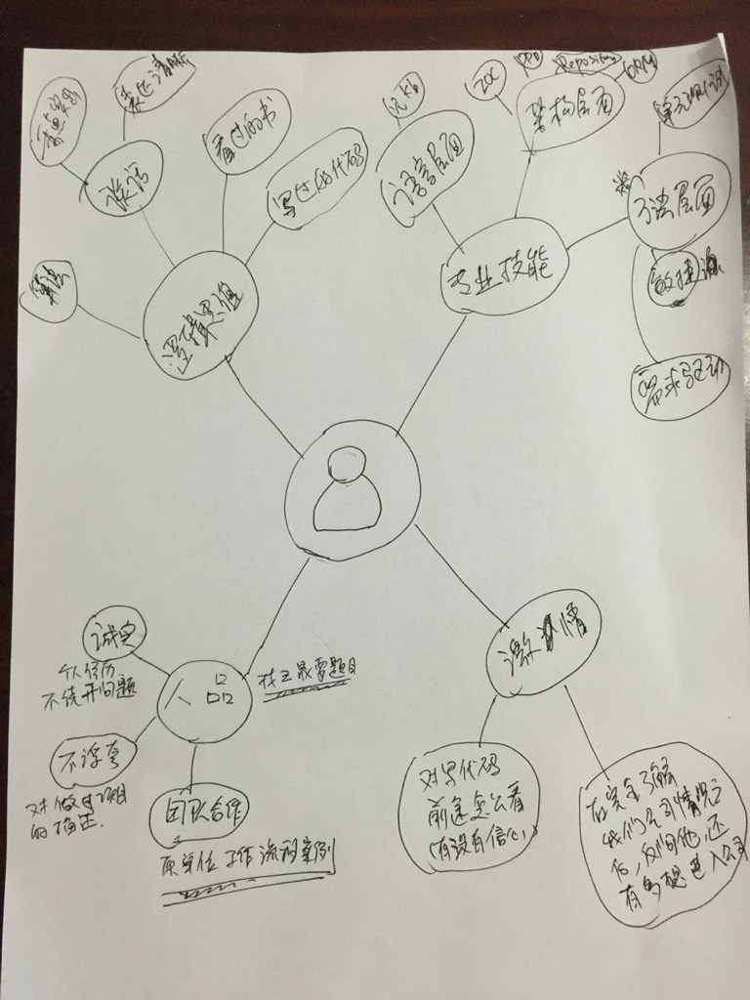

# 面试
## 面试问题
0. 请简单介绍一下你自己
0. 您个性上最大的有点是什么
0. 您最大的缺点是什么
0. 您职业技术上最大的成就是什么？
0. 请讲述您工作上遇到的一个困难或者一次与同事之间的冲突时，你是怎么处理的。
0. 在五年的时间内，你的职业规划？
0. 为什么要学习编程 （激情）
0. 最近自己在学习什么技术 （自学学习能力）
0. 您梦想的工作是什么样的？
0. 您理想的工作环境是什么样子的？
0. 您的上级和同事认为您是一个怎么样的人，他们是如何描述您的？ 	
0. 您是如何处理有压力的工作状况？
0. 你最擅长的技术方向是什么？
0. 你的业余爱好是什么？
0. 说说你对行业、技术发展趋势的看法？
0. 说说你的家庭？
0. 就你申请的这个职位，你认为你还欠缺什么？
0. 你欣赏哪种性格的人？

## 人品 
### 诚实
* 个人经历
* 不绕开问题
### 不浮夸
* 对做过的项目的描述
* 对个人能力的描述
### 团队合作
* 原单位工作流程案例
* 具体一个工作案例

## 极客精神
> 建立在能力的基础上的好奇之心与改变之力
* 读过的开源代码
* 写过的开源代码
* 对写代码前途怎么看 （有没有信心）
* 在完全了解我们公司情况之后，反问，有多想进入公司（底线）

## 逻辑思维

### 算法
#### 排序3套件
0. 准备一副一个花色的牌，洗乱，摊在桌上，请用*冒泡法排序*。
0. 把牌打乱，请用牌生成*排序二叉树*。
0. 把排好序的牌，背面朝上，在看不到牌面的情况下，请用(中序)遍历的方式把牌收起来，收起来的牌必须是排好序的。

?? 评分点
0. 冒泡
    0. 名称和概念
    0. 冒泡排序的算法过程
        0. 交换，
        0. 持续传递到最后一个
        0. “最后一个”标志的移动
    0. 冒泡形象的解释
0. 排序二叉树
    0. 名称和概念
    0. 插入算法
        0. 根
        0. 小与看左
        0. 大于看右
        0. 递归
0. 中序遍历
    0. 名称和概念 
    0. 遍历算法
        0. 左，左，左...至叶点
        0. 根
        0. 右
        0. 递归

### 谈话
* 重点突出
* 表达清晰 

### 看过的书

### 写过的代码

## 专业技能
### 方法层面
####单元测试
* 用过什么单元测试框架
* 做过项目单元测试覆盖率最高达到百分之几
* 推行单元测试，最大的困难是什么
* 单元测试，如果真正单元化。 举反例，什么不是真正的单元测试。
#### 敏捷／思维的改变
* 完美 vs 完成
* 团队目标 vs 个人习惯
* 秀技能 vs 提供服务
* 原型法迭代
* 脚本化/自动化/自动集成CI
#### DDD 
* 业务驱动，以业务模型为中心
#### 需求驱动

### 架构层面
### IOC
* IOC用什么框架
* 自动生成代码工具是否就是公司三层框架生成器
* 代码生成相对的另一个方案是什么，代码生成与元编程的对比。
### DDD
* 你们公司三层方案的理论来源，
* 实际实现情况
### 域对象的生命周期和ORM，Repository,Factory的关系
> 是架构，不是模式
#### ORM 
* 如何映射继承关系类到数据库表(可以谈设计，如果没有用过ORM）
#### Repository
* 仓储模式和DAL的区别
* Query对象
#### Factory
* 是否在架构上引入工厂层
* 对工厂的理解
* 工厂和new() 的区别和联系

### 语言层面
#### 泛型
#### 闭包（lambda)
* 给个代码案例，要求指出每行执行顺序

### JS 原型
### 回调与异步

### SPA (前端）
* AngularJS
* React
* 前端单元测试 （Jasmine)

---
# 附：脑图
