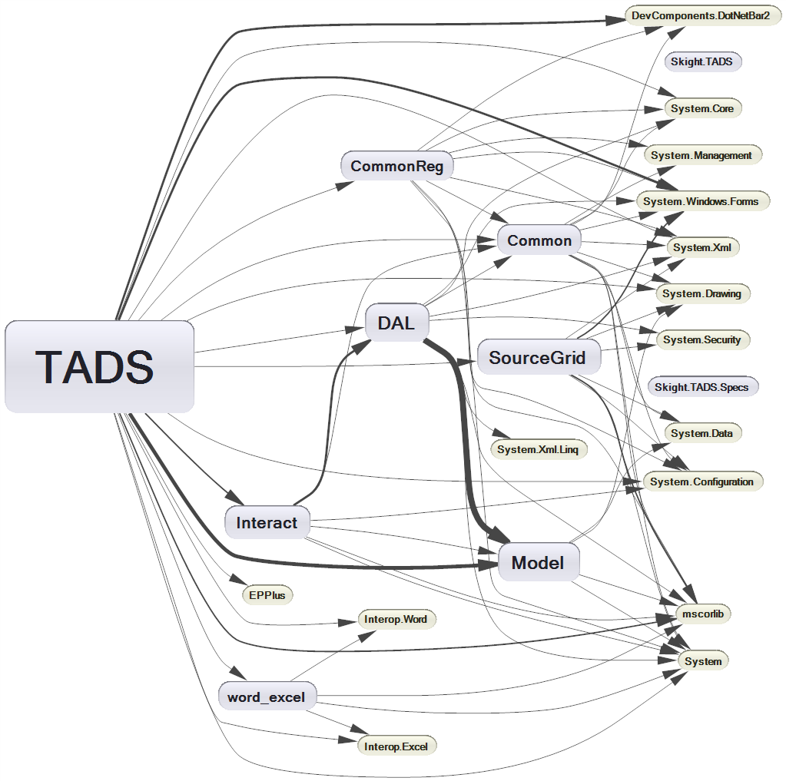
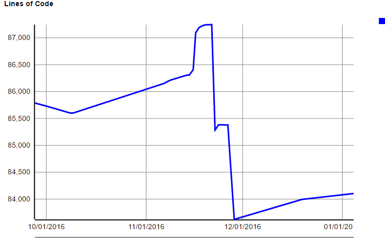
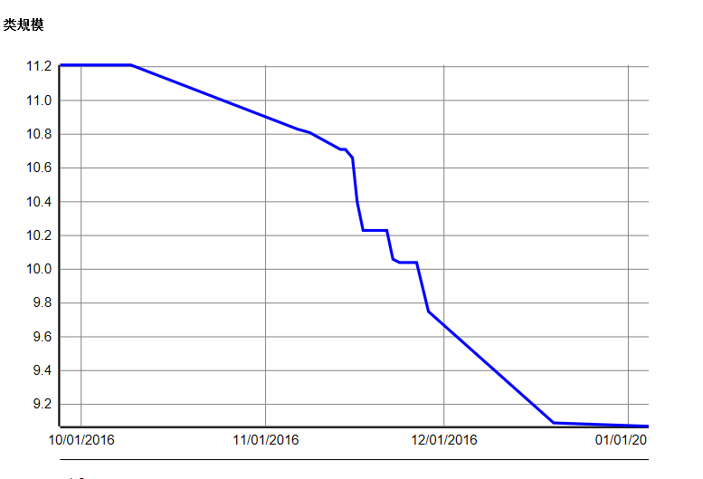

#  TADS系统重构总结汇报

湖南卓逸天成科技有限公司

---
## 一 初步理解原系统
### 书和案例
TODO:  图片
* 书
* 案例

是两个重要的手段和途径
理解和掌握基础理论

---
## 一 初步理解原系统
###遵循给定案例使用原系统，从而发现了一些Bugs
如: 模块HaveBIT属性已经从界面删除，但是矩阵计算却没有去掉相关逻辑，导致计算结果不正确。
---
## 第一阶段 初步理解原系统

* 经验：理论的掌握对新人非常关键，理论和文章的沉淀是关键，并可以持续发力

* 教训：
 * 软件内部逻辑（建模）的一致性很重要，不一致带来难以追溯的Bug
 * 软件的自测试很重要，一方面能描述需求，另外一方面时刻自检系统
---
## 第二阶段 专业工具辅助分析理解
* 专业工具能系统、准确、快速分析系统，而不是随机的人工扫描定位问题
* Reshape和NDepend
* 代码也是一个有向图，模块、类和方法都是其节点，调用是有向边。
---
###  软件系统部件依赖关系图图


--- 

### 代码量趋势图


---
### 复杂度(类规模）趋势图


---
## 三 自测试-安全之网
* 不敢动代码，必须构建自测试体系，所改动的代码包容在安全网内。
  * 定位，矩阵算法的起始点
  * 反过来分析依赖（调用）关系，确保这是唯入口，（与前面FindNextPoint）对照呼应。
  * 截获矩阵算法入口，直接输入模型
  * 后台（无界面）模型构建的思想（builder）和实现的完善。
  * 模型构建的语法，浅析业务建模、自然语言，案列诠释（辅助研究CAR）
*业务与软件（业务专家与软件开发人员）之间最完美的桥梁！

---
### 自测试代码案例
```csharp
///多层次(案例10)
/// <case>
///  +---------------------+                                      
/// |    +----------+      |      +----------+              
/// |    |    M3(F2)|      |      |    M2    |    
///(P1)-->(P3)      (P4)-->(P2)-->(P5)--->   (P6)(T1)
/// |    |          |      |      |          |     
/// |    +----------+      |      +----------+     
/// |      (M1)  (F1)      |
/// |+-------------------+ |
/// </case>
Establish context = () => 
{
    root.module("M1").with_fault("F1").module("M3").with_fault("F2");
    root.module("M1").link_inward("P1").to(root.module("M1").module("M3").input("P3"));
    root.module("M1").module("M3").link("P4").to_outward(root.module("M1").port("P2"));
    root.module("M1").link("P2").to(root.module("M2").input("P5"));
    root.module("M2").output("P6").with_test("T1");
}

private It two_reachable_F1_T0_and_F1_T1 = () => result.should_contain_only("F1-T1", "F2-T1");
```
---

## 四 重构-换汤不换药
* 修改一些bug之后，发现有些走不动
 *问题：
  *建模
    * 原软件建模是完全平面化的没有用OO的设计反映测试性模型的概念和各概念之间的关系。
    *比如模块和端口的父子关系是以原始数据存在String类型的parentID，然后每次在算法中用到的地方重复的用原始数据查询。因此大量的if语句，这是复杂度的主要来源。
  *矩阵算法
    * 每一对组合后的故障-测试对中，从一个故障出发，穷尽各条通路，看是否到达指定测试，首先排列组合所有故障和测试，这是有大量的重复路径计算，并当级数整长。每一个故障测试对几乎穷尽系统同一数量级的路径。

---
## 五 前后数据比较

---
## 六 计算机辅助研究 CAR
### 业务建模 => 代码同步建模
### 自测试 => 探索性测试

---
可以应用与研究的早期阶段，可以富足业务模型构建和数据验证。
业务模型 => 代码实现 => 探索测试 => 业务模型
